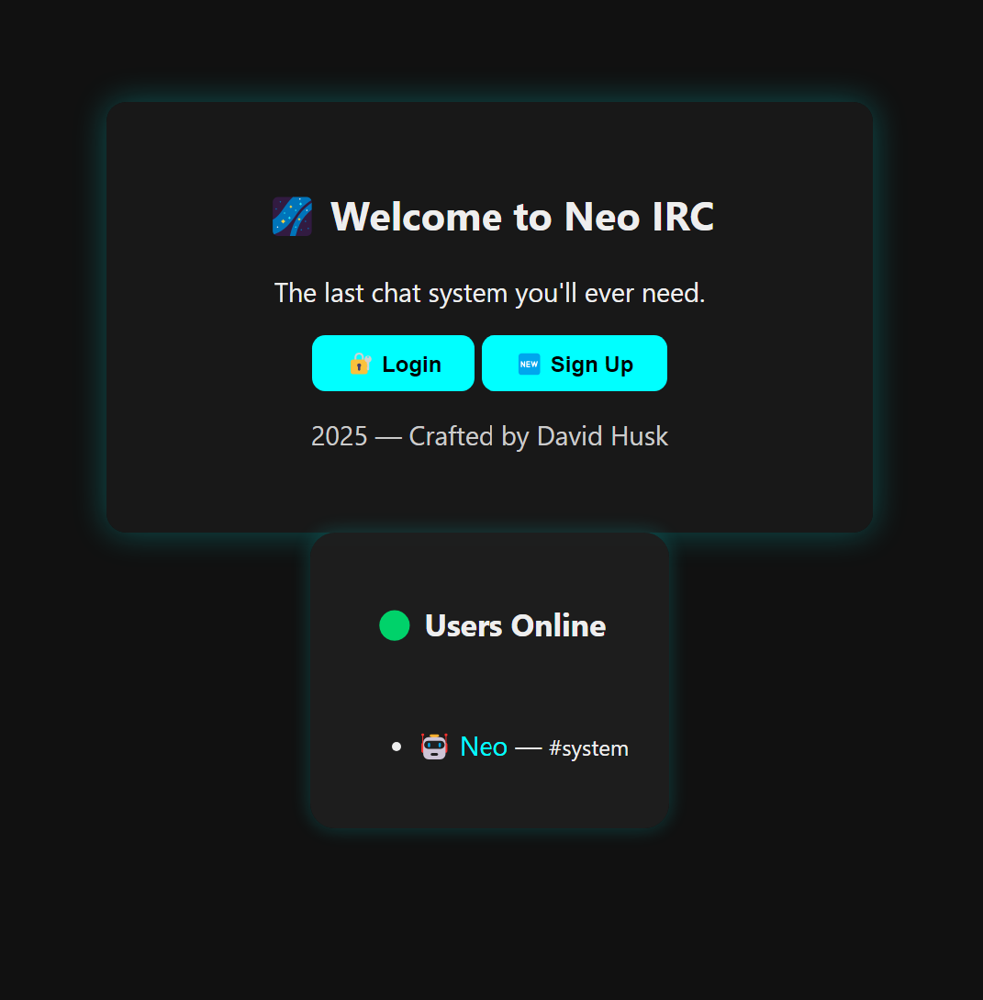
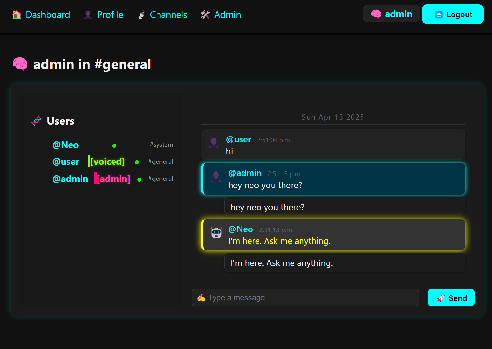
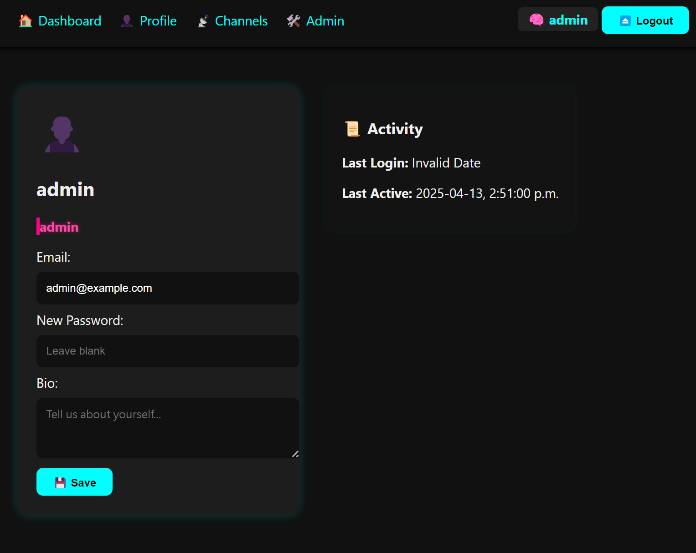
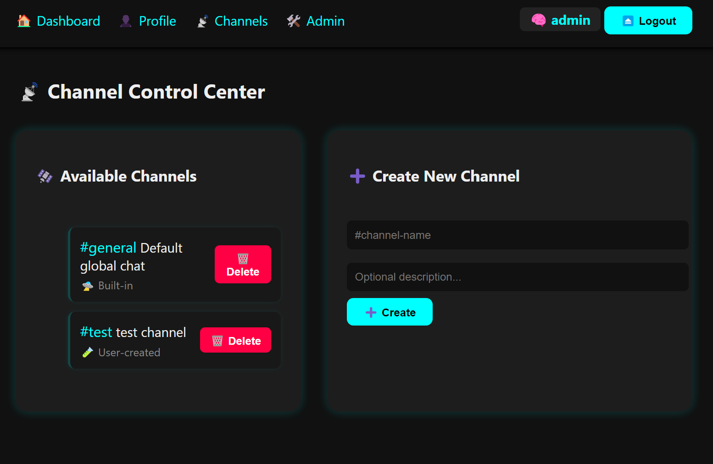
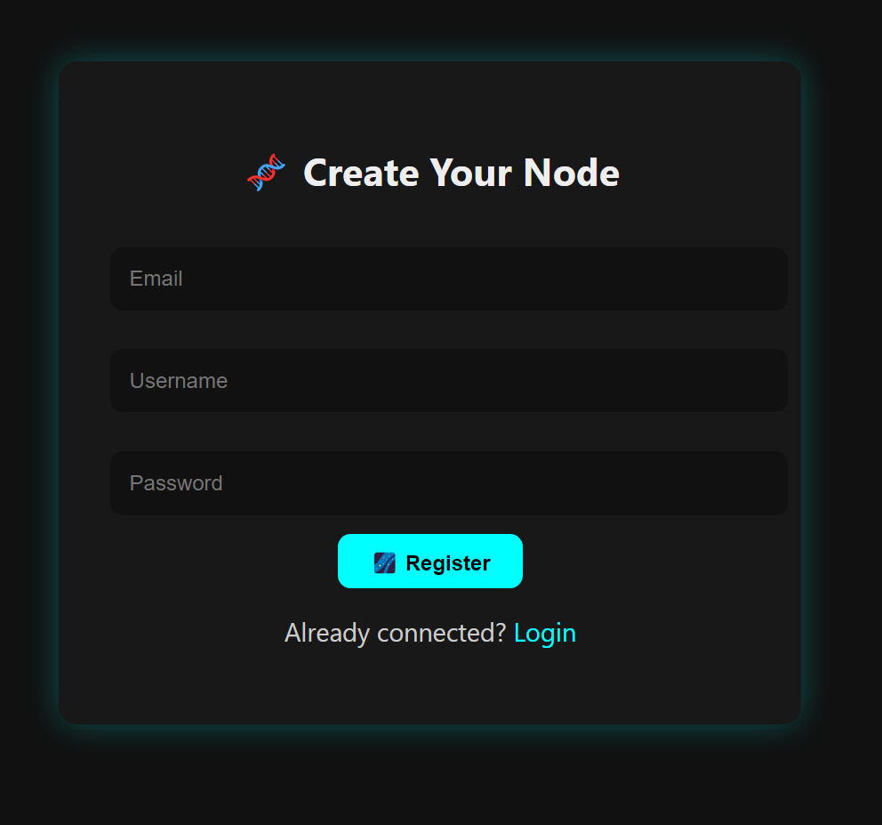
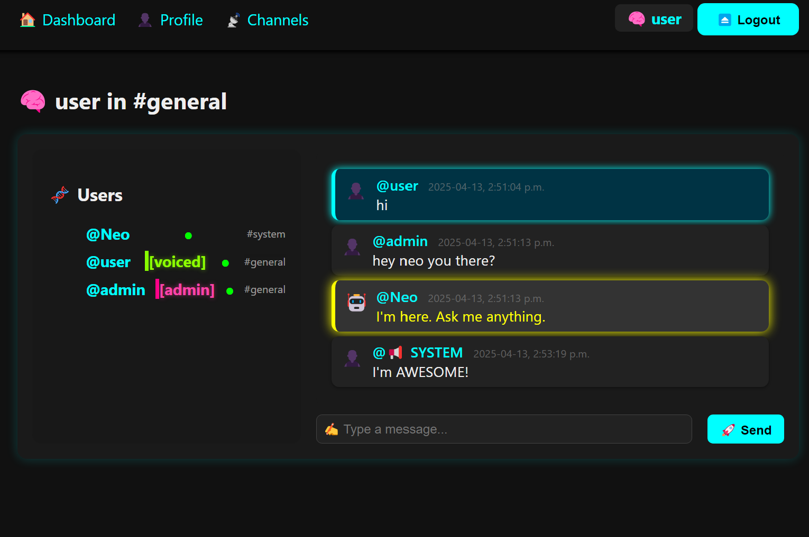
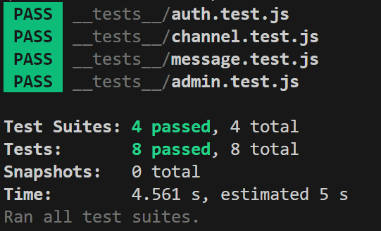

# 🌌 NeoIRC — The Last Chat System You'll Ever Need

**NeoIRC** is a real-time chat system built with ❤️ using **Node.js**, **Express**, **WebSockets**, and **MongoDB**. Designed for elegance, extensibility, and a modern IRC-like experience, NeoIRC blends old-school community spirit with today's web-native sensibilities.

> _"A node isn’t just a user—it’s a presence, a pulse in a conversation system built to resonate."_

---

## 🔗 Live Demo

[https://github.com/davehusk/NeoIRC](https://github.com/davehusk/NeoIRC)

---

## ✨ Features

- 🧠 **Real-Time WebSocket Messaging**
- 👤 **User Accounts, Profiles, and Roles (Admin, Voiced, User)**
- 🛡️ **Ban/Unban System**
- 📡 **Channel Creation, Management, and Deletion**
- 💬 **Public, Private, and Direct Messages**
- 📢 **Global Announcements & Bot Responses**
- 🛰️ **Neo Bot Presence (System Assistant)**
- 📊 **Admin Control Center** for managing users and channels
- 🔐 **Authentication via Email/Username + Password**
- 📜 **Activity Logging: Last Login / Last Active**
- 🎨 **Beautiful EJS-Based Views with Smooth UI**

---

## 🚀 Getting Started

### 1. Clone the Repo

```bash
git clone https://github.com/davehusk/NeoIRC.git
cd NeoIRC
```

### 2. Install Dependencies

```bash
npm install
```

### 3. Setup Environment

Create a `.env` file in the root directory:

```bash
touch .env
```

Add the following variables:

```env
PORT=3000
MONGO_URI=mongodb://localhost:27017/neoirc
SESSION_SECRET=keyboardcat
```

### 4. Seed Initial Data

```bash
node seed.js
```

This will create:
- An admin user (`admin / adminpass`)
- The default `general` channel
- A welcome announcement from 📢 SYSTEM

### 5. Start the Server

```bash
npm start
```

Then open your browser to [http://localhost:3000](http://localhost:3000)

---

## 🧠 Architecture Overview

### 📁 Directory Structure

```
NeoIRC/
├── models/              # Mongoose schemas
├── public/              # Frontend JS, styles, assets
├── views/               # EJS templates
├── .env                 # Environment config
├── seed.js              # Initial database seeder
└── index.js             # Main Express app
```

### 🔌 Tech Stack

| Layer        | Technology              |
|--------------|--------------------------|
| Backend      | Node.js + Express        |
| Real-Time    | express-ws (WebSocket)   |
| Database     | MongoDB + Mongoose       |
| Auth         | express-session + bcrypt |
| Templates    | EJS                      |
| Frontend     | Vanilla JS + WebSocket   |

---

## 🛠️ Admin Dashboard

Accessible by users with `admin` role at `/admin`, the control center lets you:

- 🔧 Change user roles
- ⛔ Ban/unban users
- 📢 Broadcast announcements
- 🗑️ Delete announcements
- 📜 View all users and their online presence

---

## 🧬 Neo Bot (System Assistant)

Neo lives in `#system` and:
- Appears in presence lists
- Monitors mentions of "neo"
- Replies with “I’m here. Ask me anything.”

_Neo is not sentient. Yet._

---

## 📡 Channels

- Users can create, delete, and join channels.
- The built-in `#general` is the global chat space.
- Channel management is available at `/channels`.

---

## 🔐 Roles & Permissions

| Role   | Description                |
|--------|----------------------------|
| admin  | Full control               |
| voiced | Trusted user, limited power |
| user   | Default role               |
| banned | Cannot send messages or connect |

---

## 🌍 RESTful Routes Summary

| Method | Path                        | Description                       |
|--------|-----------------------------|-----------------------------------|
| GET    | `/login`, `/signup`        | Auth pages                        |
| POST   | `/login`, `/signup`        | Auth actions                      |
| POST   | `/logout`                  | Logout session                    |
| GET    | `/dashboard`               | Main chat view                    |
| POST   | `/send`                    | Send message (DM / global)        |
| GET    | `/channels`, `/profile`    | Channel and profile views         |
| POST   | `/channels/create/delete`  | Channel management                |
| GET    | `/admin`                   | Admin dashboard                   |
| POST   | `/admin/ban/role`          | Admin user control                |
| POST   | `/announcements/delete`    | Remove global message             |
| POST   | `/messages/clear`          | Clear messages per channel        |

---

## 🌱 Database Models

- **User**: `username`, `email`, `password`, `role`, `isBanned`, `isOnline`, `bio`
- **Message**: `sender`, `content`, `channel`, `isPrivate`, `isAnnouncement`, `to`
- **Channel**: `name`, `description`, `createdBy`
- **Notification**: *(future-ready for alerts)*
- **PrivateMessage**: *(structured separation for private chat)*

---

## 🧪 Sample Admin Credentials

```txt
username: admin
password: adminpass
```

Change this immediately after deploying in production!

---

## 🔒 Security Notes

- Passwords are hashed using bcrypt.
- Sessions are stored securely via express-session.
- Banned users are blocked from connecting or sending messages.
- Admin-only routes are protected by middleware (`requireAdmin`).

---

## 🤖 Ideas for Future Enhancements

- AI-enhanced Neo assistant with memory
- File and image uploads
- Voice channels or ephemeral groups
- Mobile-first progressive web app (PWA)
- Socket rate-limiting / spam protection

---

## 📬 Contributing

Pull requests welcome! If you have ideas, fixes, or features to add:

1. Fork this repo
2. Create a new branch: `git checkout -b feature-xyz`
3. Commit your changes: `git commit -m 'Add cool feature'`
4. Push to the branch: `git push origin feature-xyz`
5. Submit a PR ❤️

---

## 👤 Author

Crafted by [David Husk](https://github.com/davehusk)

> "_A system isn’t just backend code. It’s breath. It’s rhythm. It’s designed presence._"

---

## 📄 License

MIT License — do what you want, just don’t be a jerk.

---

## 🖼️ Demo Screens

Experience NeoIRC in motion through key interfaces:

### 🌌 Home / Login


### 🧠 Live Chat Interface


### 👤 User Profile View


### 📡 Channel Management


### 🛠️ Admin Control Center


### 🆕 Sign Up Flow


### 🧬 User Dashboard


### Test Run


---

## ⭐️ Star the Repo

If this made you nod, smile, or ship faster—consider [starring ⭐️](https://github.com/davehusk/NeoIRC) the repo!

Let’s keep the signal strong.

---
